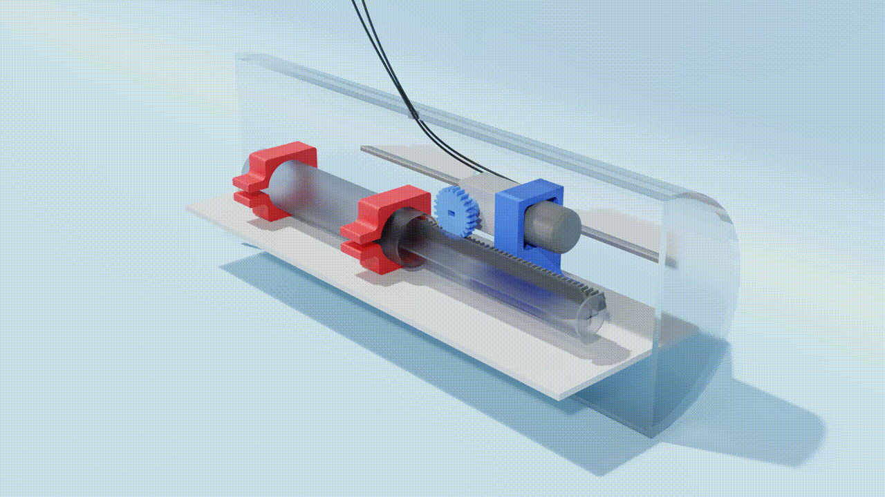

This is a submarine model that I designed for University project, we had only one week to create a working submarine model.

It draws water into a syringe to become more dense and sink, then expels it to rise to the surface.

I designed and animated the parts in Blender which were then 3D printed.

<video controls src="upAndDownss.mp4" title="Title" style="width: 50%;"></video>

(2x speed)
